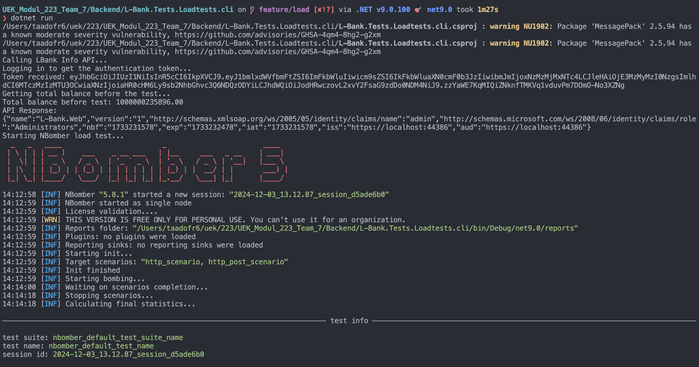
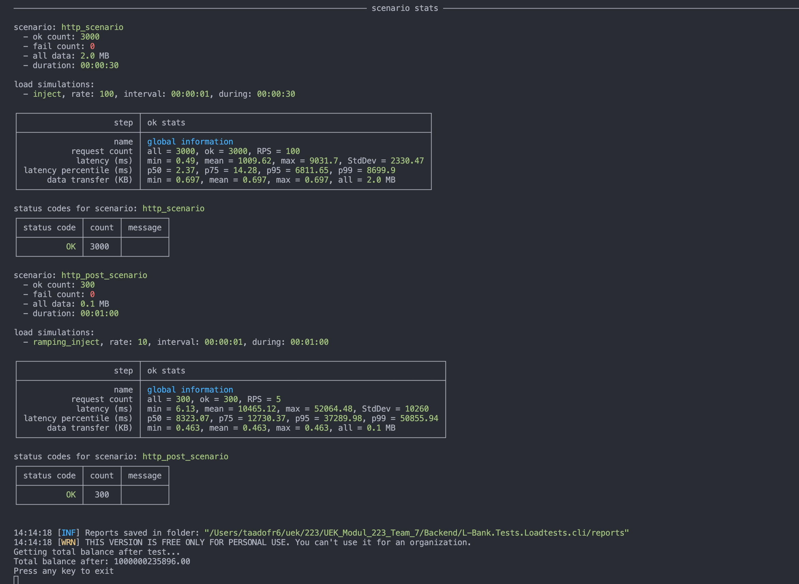

# 223-ma-app

Willkommen beim Ük 223. Dieses Repository enthält den Code für die Applikation, die wir im Modul 223 erstellen werden, sowie die Lerninhalte.

Es dient jedoch lediglich als Ablage dieser Informationen. Gewisse Informationen befinden sich auch im Learningview, ebenfalls wird wie gewohnt im Learningview die Dokumentation der Arbeit abgegeben, sowie der Progress dokumentiert.

## Aufbau der App

L-Bank ist eine Webanwendung, die es Nutzern (Administratoren und normalen Benutzern) erlaubt, finanzielle Transaktionen zu verwalten. Sie umfasst folgende Module:

- **Backend** (C#/.NET):
  - Implementierung von Funktionen zur Buchung und Verwaltung von Ledgers.
  - Verwenden von Entity Framework Core zur Datenbankverwaltung.
  - REST-API zur Kommunikation mit dem Frontend.

- **Frontend** (Angular):
  - Benutzeroberfläche zur Interaktion mit den Funktionen der Anwendung.
  - Erlaubt das Erstellen und Löschen von Ledgers sowie das Ausführen von Buchungen zwischen diesen.

- **Datenbank**:
  - Speicherung aller relevanten Finanzinformationen wie Ledger-Daten und Benutzerinformationen.
  - SQLite wird als Datenbank verwendet.

## Starten der Anwendung

### Backend (L-Bank.Web)
1. Stelle sicher, dass alle Abhängigkeiten im Verzeichnis installiert sind.
2. Setze die `appsettings.json` Konfigurationsdateien korrekt (einschließlich der `DatabaseSettings` und `JwtSettings`).
3. Führe folgenden Befehl im Verzeichnis des Projekts `L-Bank.Web` aus:
   ```sh
   dotnet run
   ```
4. Swagger-Dokumentation ist unter `http://localhost:5000/index.html` verfügbar, um die REST-API zu testen.

### Frontend
1. Navigiere in das Verzeichnis `Frontend`.
2. Stelle sicher, dass Node.js installiert ist und alle Pakete installiert sind:
   ```sh
   npm install
   ```
3. Starte das Frontend mit folgendem Befehl:
   ```sh
   ng serve
   ```
4. Das Frontend ist unter `http://localhost:4200` zugänglich.

## Multi-User-Probleme und ihre Lösungen

Die Anwendung ermöglicht es mehreren Nutzern gleichzeitig, Transaktionen und Ledger-Operationen auszuführen. Die größten Multi-User-Probleme betreffen hier:

- **Konsistenz der Daten** bei parallelen Zugriffen (z.B. wenn zwei Benutzer versuchen, gleichzeitig denselben Ledger zu bearbeiten).
- **Deadlocks**, wenn mehrere Transaktionen um dieselben Ressourcen konkurrieren.

### Lösungen
1. **Transaktionssicherheit**:
   - Für kritische Operationen (z.B. das Buchen von Geldbeträgen zwischen zwei Ledgers) werden SQL-Transaktionen verwendet, um sicherzustellen, dass alle Operationen vollständig und konsistent sind. Bei Fehlern wird eine Rollback-Operation durchgeführt.
2. **Optimistische Synchronisation**:
   - Es wurde darauf geachtet, alle Buchungsoperationen so zu implementieren, dass der Zustand der Datenbank durch Sperrungen (Locks) in der Datenbank geschützt wird, um Konflikte zu vermeiden.
3. **Fehlermanagement**:
   - Deadlocks und Verbindungsprobleme werden durch spezielle Fehlerbehandlung (mit automatischem Wiederholungsmechanismus) adressiert, um zu gewährleisten, dass Operationen korrekt abgeschlossen werden.

## Dokumentation der Tests zur Transaktionssicherheit

Die Anwendung umfasst umfassende Unit- und Loadtests, um die Transaktionssicherheit und das Verhalten der Buchungen zu prüfen. Die Tests befinden sich in folgenden Projekten:

#### Unit-Tests: L-Bank.Concurrent.UnitTests
- Datei: UnitTests.cs

```sh
Book_ShouldTransferFunds_WhenFundsAreSufficient
   ```
Überprüft erfolgreiche Buchungen bei ausreichenden Mitteln und korrekte Aktualisierung der Salden.

```sh
Book_ShouldThrowException_WhenFundsAreInsufficient
   ```
Stellt sicher, dass bei unzureichenden Mitteln eine Exception ausgelöst wird.

```sh
Book_ShouldRetry_WhenDeadlockOccurs
   ```

Simuliert Deadlocks und prüft, ob der Vorgang korrekt wiederholt wird.

```sh
Test_Service_Using_RealSqlServer
   ```
Testet Datenbankzugriffe mit einem echten SQL Server.


#### Loadtests: L-Bank.Tests.Loadtests.cli
Datei: LoadTests.cs
#### Authentifizierung
Simuliert Logins und API-Calls, um Zugriffstoken zu generieren.

### API-Tests
Szenarien:
```sh
http_scenario
   ```
Führt GET-Requests zur Abfrage von Buchungsinformationen durch.

```sh
http_post_scenario
   ```
Simuliert POST-Requests für Buchungsvorgänge.

```sh
Balance-Konsistenzprüfung
   ```
Verifiziert, dass die Gesamtsalden vor und nach Tests unverändert sind.





In den obenstehenden Abbildungen sind erfolgreiche Lasttests dargestellt, die sicherstellen, dass während des Tests keine Gelder verloren gehen und dass die Systemintegrität gewahrt bleibt. Der Test prüft, ob der Gesamtbetrag auf allen Konten (Ledgers) vor und nach den Testbuchungen gleich bleibt.

#### Ablauf des Tests:

1. **Login und Token-Abfrage:**
   - Zuerst wird ein Login durchgeführt, um ein **Bearer Token** zu erhalten, das für die Authentifizierung erforderlich ist, um auf geschützte Endpunkte zuzugreifen (Abbildung 1).
2. **Gesamtguthaben vor dem Test:**
   - Vor Beginn des Tests wird das gesamte Guthaben im System abgefragt, um eine Ausgangsbasis zu schaffen (Abbildung 1). Man sieht das gesamte Guthaben vor dem Test ist: **1000000235896.00**
3. **Testaufruf der API:**
   - Ein API-Aufruf an `/api/v1/lbankinfo` wird durchgeführt, um sicherzustellen, dass die Verbindung zum System funktioniert und die Authentifizierung korrekt ist (Abbildung 1).
4. **Durchführung des Lasttests mit NBomber:**
   - Der Lasttest wird mit **NBomber** durchgeführt. Zwei Szenarien werden simuliert:
     - **HTTP-Szenario:** Einfache API-Anfragen werden simuliert.
     - **Booking-Szenario:** Buchungen zwischen zwei Konten werden simuliert (Abbildung 2).
5. **Gesamtguthaben nach dem Test:**
   - Nach dem Test wird das Guthaben erneut abgefragt (Abbildung 2). Wie ersischtlich hat sich der Betrag nicht verändert und ist immer noch **1000000235896.00.**
6. **Überprüfung der Konsistenz:**
   - Es wird überprüft, ob das Gesamtguthaben vor und nach dem Test übereinstimmt. Wenn dies der Fall ist, bedeutet es, dass keine Gelder verloren gegangen sind (Abbildung 2).

#### Warum ist dieser Test wichtig?

- **Konsistenzprüfung:** Der Test stellt sicher, dass das Gesamtguthaben im System vor und nach dem Test gleich bleibt, auch wenn während des Tests Transaktionen durchgeführt werden.
- **Fehlererkennung:** So werden mögliche Fehlerquellen wie verlorenes Geld oder Inkonsistenzen im System durch Lasttests erkannt.

#### Fazit:

Dieser Test gewährleistet, dass das System unter Last korrekt funktioniert, ohne dass Geld verloren geht. Er hilft, die Stabilität und Integrität der Finanzoperationen zu bestätigen, auch bei hoher Belastung.
Die Kombination aus Unit- und Loadtests gewährleistet robuste Transaktionen und stabile Systemperformance.
